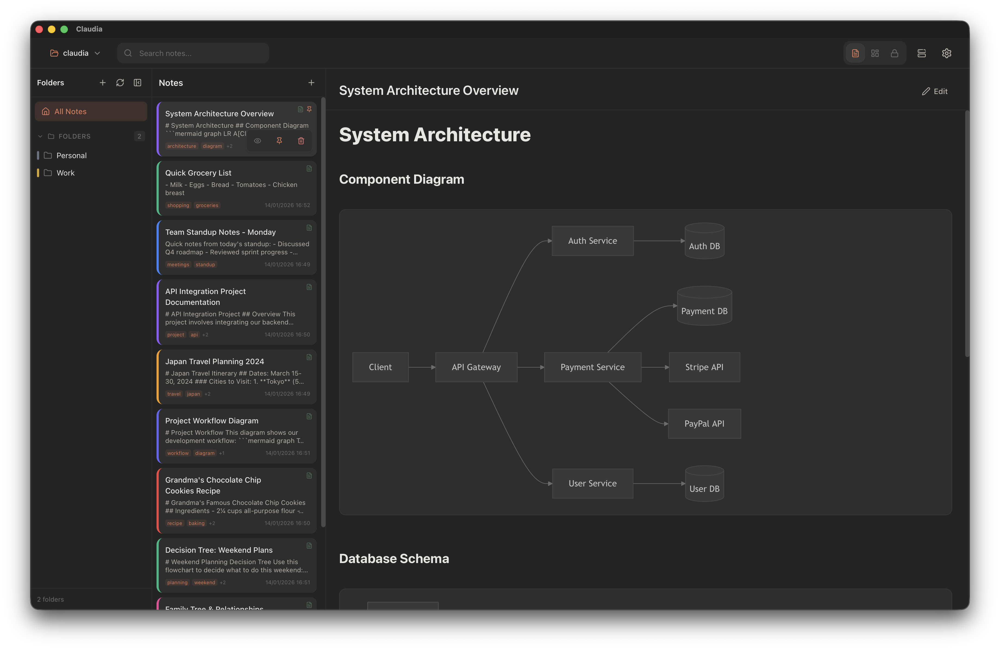
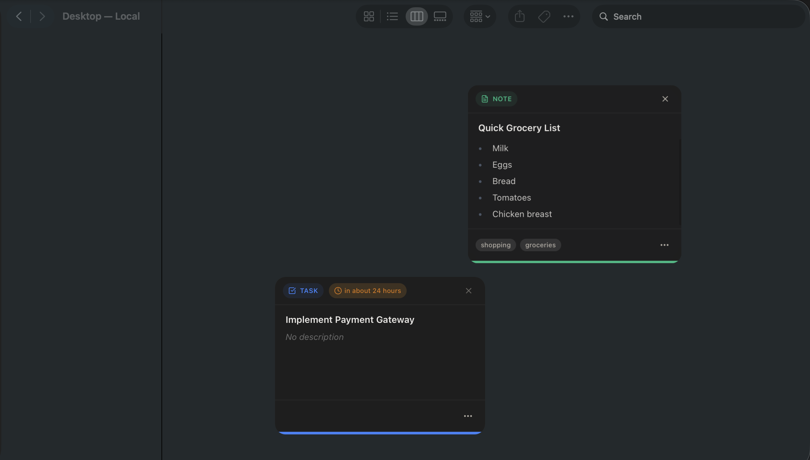
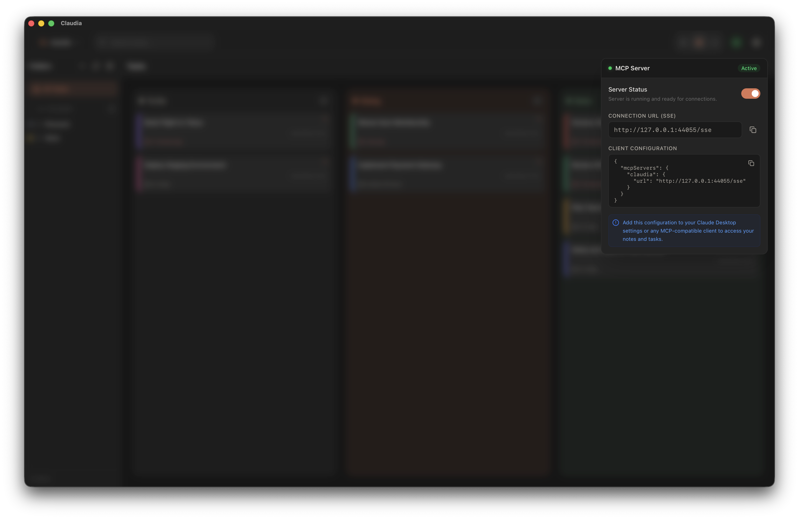
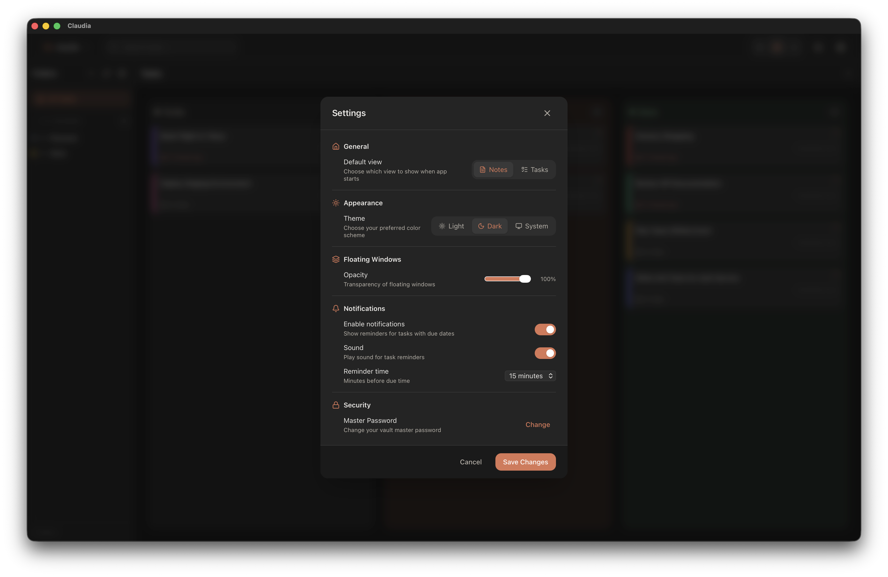

# Claudia ✨

> Your personal companion for notes, tasks, and passwords — beautifully organized, always accessible.

---

## 🌟 What is Claudia?

Claudia is a **desktop productivity app** built with [Tauri](https://tauri.app/) (Rust backend) and React. It keeps your notes, tasks, and passwords in one place, stored locally on your computer as readable markdown files.

**Key highlights:**
- 📝 **Notes** with markdown, code highlighting, and Mermaid diagrams
- ✅ **Tasks** with a kanban board (Todo → Doing → Done)
- 🔐 **Passwords** with AES-256-GCM encryption
- 🪟 **Floating windows** that stay on top of everything
- 🎨 **Beautiful themes** — light, dark, or system
- 🤖 **MCP integration** — works with Claude and AI assistants

---

## 📸 Screenshots

### Home Screen


### Notes View


### Tasks Board


### Password Manager


### Floating Windows


### MCP Server


### Settings


---

## ✨ Features

### 📝 Notes

Write notes with full markdown support, organized in folders.

| Feature | Status |
|---------|:------:|
| Markdown with GFM | ✅ |
| Code syntax highlighting | ✅ |
| Mermaid diagrams | ✅ |
| Pin notes | ✅ |
| Color coding | ✅ |
| Tags | ✅ |
| Drag & drop reordering | ✅ |
| Float as separate window | ✅ |

---

### ✅ Tasks

A kanban board to manage your to-dos with drag-and-drop between columns.

| Column | Description |
|--------|-------------|
| **Todo** | Tasks waiting to be started |
| **Doing** | Tasks you're working on |
| **Done** | Completed tasks |
| **Archived** | Old tasks (status available in data model) |

| Feature | Status |
|---------|:------:|
| Drag & drop between columns | ✅ |
| Due dates | ✅ |
| Pin tasks | ✅ |
| Color coding | ✅ |
| Tags | ✅ |
| Float as separate window | ✅ |

---

### 🔐 Password Manager

Your secure vault for passwords with military-grade encryption.

| Feature | Status |
|---------|:------:|
| Master password setup | ✅ |
| AES-256-GCM encryption | ✅ |
| Argon2 key derivation | ✅ |
| Store URL, username, password, notes | ✅ |
| Show/hide passwords | ✅ |
| One-click copy | ✅ |
| Color coding | ✅ |
| Tags | ✅ |
| Pin passwords | ✅ |
| Drag & drop reordering | ✅ |
| Change master password | ✅ |

> 🔒 **Security**: Your passwords are encrypted locally using AES-256-GCM with keys derived via Argon2. The master password never leaves your device.

---

### 📁 Folders

A unified folder system that can contain both notes and tasks.

| Feature | Status |
|---------|:------:|
| Create folders | ✅ |
| Nested subfolders | ✅ |
| Color customization | ✅ |
| Icon customization | ✅ |
| Pin/favorite folders | ✅ |
| Delete folders | ✅ |

---

### 🪟 Floating Windows

Pop out notes or tasks as always-on-top floating windows.

| Feature | Status |
|---------|:------:|
| Always on top | ✅ |
| Glass/vibrancy effect (macOS) | ✅ |
| Position persistence | ✅ |
| Size persistence | ✅ |
| Adjustable opacity | ✅ |
| Toggle all windows | ✅ |

---

### ⚙️ Settings

| Setting | Options |
|---------|---------|
| Theme | Light, Dark, System |
| Default view | Notes or Tasks |
| Default color | Any color |
| Notifications | Enable/disable |
| Notification sound | Enable/disable |
| Reminder time | Minutes before due |
| Floating window opacity | 0-100% |

---

### 🤖 MCP Integration

Claudia includes a built-in MCP (Model Context Protocol) server for AI assistant integration.

**Available MCP Tools:**

| Category | Tools |
|----------|-------|
| **Notes** | `list_notes`, `get_note`, `create_note`, `update_note`, `delete_note`, `search_notes`, `move_note_to_folder`, `show_note`, `hide_note` |
| **Tasks** | `list_tasks`, `get_task`, `create_task`, `update_task`, `delete_task`, `complete_task`, `move_task_to_folder`, `show_task`, `hide_task` |
| **Folders** | `list_folders`, `create_folder`, `delete_folder` |

---

## 💾 Data Storage

Your data is stored as markdown files on your filesystem:

```
📁 Your Workspace
├── 📁 folders/
│   ├── .folder.md          # Folder metadata (optional)
│   ├── 000001-my-note.md   # Notes (rank-prefix + slug)
│   ├── 📁 tasks/
│   │   ├── 📁 todo/        # Tasks by status
│   │   ├── 📁 doing/
│   │   └── 📁 done/
│   └── 📁 passwords/
│       └── 000001-login.md # Encrypted passwords
└── 📁 My Project/          # Subfolders
    └── ...
```

**Benefits:**
- 📖 Readable markdown files
- 💾 Easy to backup — just copy the folder
- 🔄 Git-friendly for version control
- ☁️ Sync with Dropbox, iCloud, etc.
- 🔒 Private — 100% local, no cloud

---

## 🚀 Development

### Prerequisites

- [Node.js](https://nodejs.org/) (v18+)
- [Rust](https://rustup.rs/)
- [Tauri CLI](https://tauri.app/v1/guides/getting-started/prerequisites)

### Setup

```bash
# Install dependencies
npm install

# Run in development mode
npm run tauri dev

# Build for production
npm run tauri build
```

---

## 🛠️ Tech Stack

| Layer | Technology |
|-------|------------|
| Frontend | React, TypeScript, Vite |
| Styling | Vanilla CSS, Framer Motion |
| State | Zustand |
| Backend | Rust, Tauri v2 |
| Encryption | AES-256-GCM, Argon2 |
| MCP | rmcp SDK |

---

## ❓ FAQ

**Q: Where is my data stored?**
> In the workspace folder you chose. You can find the path in Settings.

**Q: Can I sync between devices?**
> Yes! Put your workspace in a synced folder (Dropbox, iCloud, Google Drive).

**Q: Is my password vault secure?**
> Yes! We use AES-256-GCM encryption with Argon2 key derivation. Your master password never leaves your device.

**Q: Can I use Claudia offline?**
> Absolutely! Claudia works 100% offline. No internet required.

**Q: How do I backup my data?**
> Just copy your workspace folder. That's it!

**Q: Does Claudia collect any data?**
> No. Zero tracking, zero analytics, zero cloud. Your data stays on your device.

---

## 📜 License

This work is licensed under [CC BY 4.0](https://creativecommons.org/licenses/by/4.0/) © Mourad GHAFIRI

---

<p align="center">
  <b>Made with ❤️ for people who love staying organized</b>
  <br><br>
  <i>Claudia v0.2.0</i>
</p>
